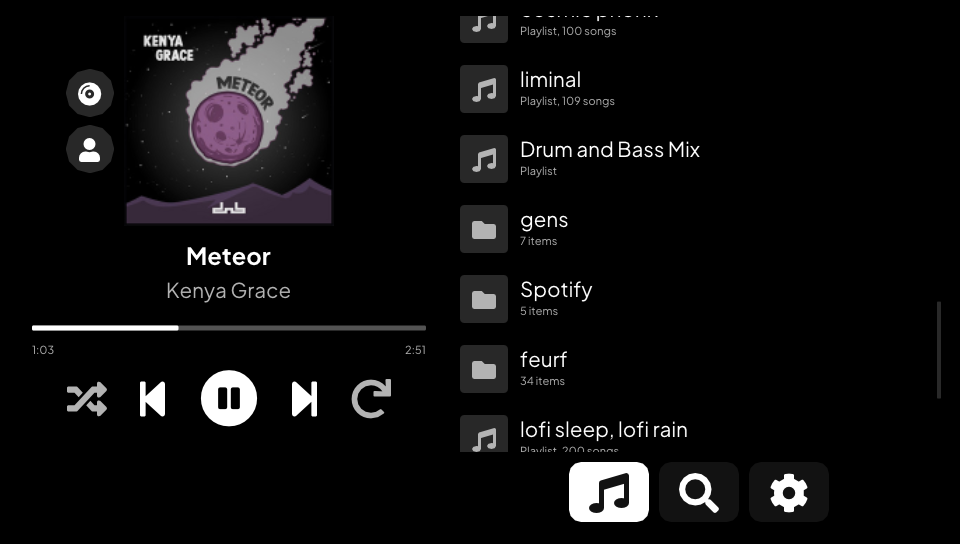
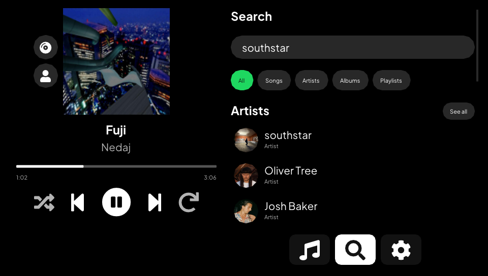
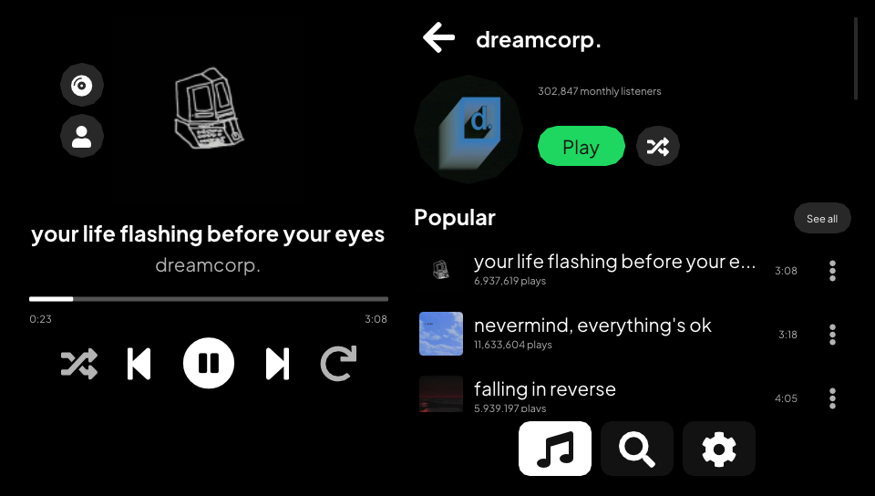
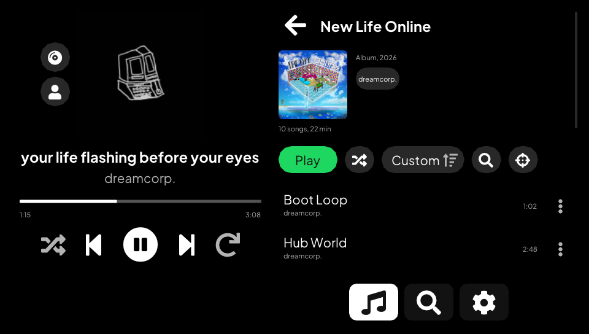
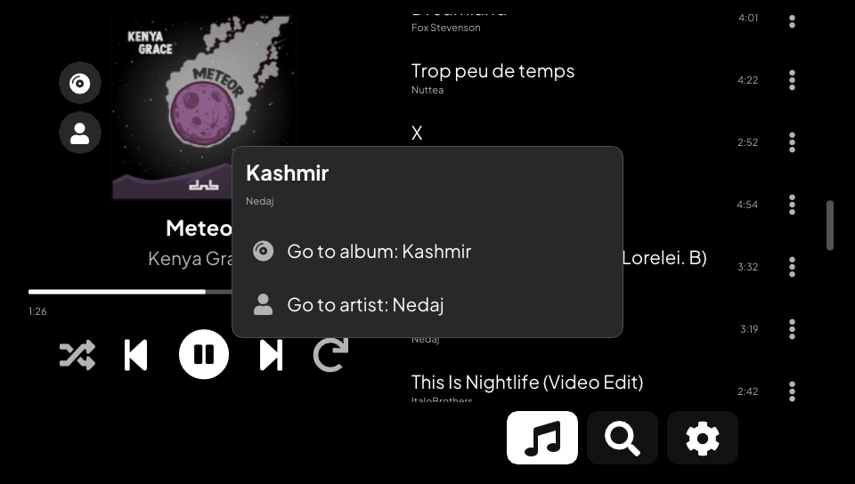

[](https://github.com/klNuno/spotivita/actions/workflows/ci.yml)

# Spotivita

A Spotify player for the PS Vita. Open your playlists, search, browse artists
and albums, and play it all on the console. Your phone can also pick the Vita
as a speaker from the Spotify app.


It needs Spotify Premium. Spotivita started as a fork of
[cspot_vita](https://github.com/michal4132/cspot_vita) and still streams
through [cspot](https://github.com/feelfreelinux/cspot). The interface, the
library, search, browsing, local playback control and most of the network code
are new.

| Your library | Search |
| --- | --- |
|  |  |
| **Artist page** | **Album** |
|  |  |
| **Song menu** | **First launch** |
|  |  |

## What it does

### Library

- Liked Songs first, then your playlists and folders in the order Spotify
  shows them. The list opens at once from a cache and refreshes in the
  background at each launch.
- Playlists load whole. A 3800-song playlist lists every title in about 3
  seconds the first time, then opens at once. Each one shows its song count
  and total length.
- Sort a playlist by title, artist, album, date added or duration, either way.
  Each playlist keeps its sort. The filter keeps the songs whose title, artist
  or album match what you type.
- Shuffle play, a button that scrolls to the song playing, and a fast-scroll
  thumb that shows the letter, date or position under your finger. The right
  stick scrolls faster the longer you hold it.

### Search and browsing

- Search for songs, artists, albums and playlists. The first page shows a few
  of each, with the top artist first when it matches. A chip opens one kind
  with every result, a page at a time.
- Artist pages list popular songs, albums, singles and EPs, compilations,
  "Appears on", playlists and similar artists. Each section has a "See all"
  page, and the artist plays in order or shuffled.
- Albums and public playlists open like your own playlists, with their cover,
  sort and filter. Browsing never adds anything to your account.
- Every song has a menu (the dots, or triangle on the row) that goes to its
  album or one of its artists. On the player, the cover and the title open the
  album and the artist line opens the artist. The two buttons by the cover do
  the same with the gamepad.

### Playback

- Play, pause, next, previous, seek, shuffle and repeat, handled on the Vita.
  Pause cuts the sound at once. Previous restarts the song after its first 3
  seconds, like Spotify.
- The console's volume buttons set the level. The app always plays at full.
- A sleep timer stops the music after 15 minutes, 30 minutes, 1 hour or at the
  end of the song.
- Audio quality in Settings: Low (96 kb/s), Normal (160 kb/s) or Very high
  (320 kb/s, the default).
- Press the PS button and the music keeps playing, screen off included. The
  interface stops drawing while it is in the background.
- Wi-Fi off at launch or lost mid-song: the app keeps retrying every 5 seconds
  and picks the song up again once it reconnects.

### Spotify Connect

- The Vita shows up in the device list of the Spotify app, so your phone can
  drive it.
- One device plays at a time, like Spotify. Start a song on your phone and the
  Vita pauses. Start one on the Vita and the phone pauses.
- While another device plays, the Vita shows its song and controls it: play,
  pause, next, previous and seek. "Play here" moves the music to the Vita at
  the same spot.

### Display

- A black background, which turns the pixels off on the OLED model.
- Greek and Cyrillic titles draw fine. The Vita's fonts have no emoji or CJK
  characters, so the app leaves those out.
- It draws with vita2d and precompiled shaders, so `libshacccg.suprx` is not
  needed.

## Status

Everything above runs in the Vita3K emulator. Vita3K has no sound, so there
playback is checked by watching the position move. On a real PS Vita the app
plays, searches and keeps playing in the background.

Not tried on a console yet: a real Wi-Fi drop (Vita3K saw the lost link and
the reconnect), the handover with a real phone (tested against a simulated
one), and the artist, album and song menu pages. If something breaks on your
Vita, please open an issue.

## Install

1. Download `spotivita.vpk` from the
   [latest release](https://github.com/klNuno/spotivita/releases/latest).
2. Install it with VitaShell. Its TITLEID is `SPOTIVITA`, so it sits next to an
   existing CSpot install instead of replacing it.
3. Open Spotivita. It waits for Spotify Connect.
4. On your phone, on the same Wi-Fi, open Spotify, tap the devices icon and
   pick Spotivita. The Vita keeps that login, so later launches connect on
   their own.

Spotify turned off username and password logins in 2024. The Vita cannot log
in by itself anymore, so your phone hands it a login over the local network
(Zeroconf).

Each CI run on `master` also attaches a build as the `spotivita-vpk` artifact
(Actions tab, GitHub login needed).

## How it talks to Spotify

- cspot keeps the session with Spotify's access point, streams and decodes the
  audio (Ogg Vorbis), and answers Spotify Connect.
- Playlists, song names, albums and the album and artists of a song come from
  spclient. Search and artist pages use the same GraphQL endpoint as the web
  player.
- The public Web API answers 429 to every request from this client, so nothing
  depends on it. When you play a song, the Vita builds the queue itself and
  hands it to cspot.
- Search and artist pages send query hashes taken from the web player. When
  Spotify rotates them, those pages show "Spotify changed its API" until the
  app is updated.

## Building

You need [vitasdk](https://vitasdk.org) with the `vita2d`, `imgui-vita2d`,
`curl` and `openssl` packages, plus `protoc` and Python's `protobuf` and
`setuptools` on the host for nanopb.

```shell
git clone --recursive https://github.com/klNuno/spotivita.git
cd spotivita
cmake -B build && cmake --build build
```

The VPK lands in `build/spotivita.vpk`. `.github/workflows/ci.yml` builds it in
the `vitasdk/vitasdk` Docker image. That image installs OpenSSL 1.1.1 while its
libcurl expects 1.0.2, so the workflow swaps the package back first. Pushing a
`v*` tag also publishes a release with the VPK, its notes taken from the
annotated tag's message.

## Testing without the console in your hands

A devkit build adds a TCP server on port 2138. It returns the app state as
JSON and takes taps, swipes, buttons, screenshots, logs, file transfers and
eboot hot swaps. It can read and write files on the console, so release builds
leave it out.

```shell
cmake -B build/dev -DSPOTIVITA_DEVKIT=ON && cmake --build build/dev
python tools/vitactl.py find                 # finds the Vita on your /24
VITA_HOST=<vita-ip> python tools/vitactl.py deploy build/dev/eboot.bin
VITA_HOST=<vita-ip> python tools/vitactl.py "state; tap 660 492; shot s.png"
```

- `tools/vitasetup.py` prepares a console once. Open VitaShell, press SELECT
  to start its FTP server, run the script, then reboot. It installs
  [vitacompanion](https://github.com/devnoname120/vitacompanion), which serves
  FTP, takes launch, quit and reboot commands, and keeps the Vita awake. It also
  copies the dev build over the installed app, or leaves the VPK in
  `ux0:data/spotivita/` for VitaShell when the app is not installed yet. After
  that, `vitactl deploy` works even when the app has crashed.
- `tools/vita3k` runs the same build in Vita3K on a hidden Windows desktop,
  with no window on your screen. `tools/vita3k/login.py` logs the emulator in
  without a phone. Details are in [tools/vita3k/README.md](tools/vita3k/README.md).
- `vitactl netdrop` cuts the link to Spotify's access point the way a Wi-Fi
  loss does, and `netdrop write` makes the next send fail.

## Credits

- [michal4132](https://github.com/michal4132) for cspot_vita, the base of this
  project.
- [feelfreelinux](https://github.com/feelfreelinux) and contributors for cspot
  and bell.
- The vitasdk, vita2d, Dear ImGui and vitacompanion projects.
- [Plus Jakarta Sans](https://github.com/tokotype/PlusJakartaSans) (OFL) and
  [Roboto](https://github.com/googlefonts/roboto) (Apache License 2.0, see
  `common_data/Roboto-LICENSE.txt`).

## Disclaimer

Using this code to connect to Spotify's API may be prohibited by their terms of
service. Use at your own risk. The developers are not responsible for any
negative consequences, including account closure.
