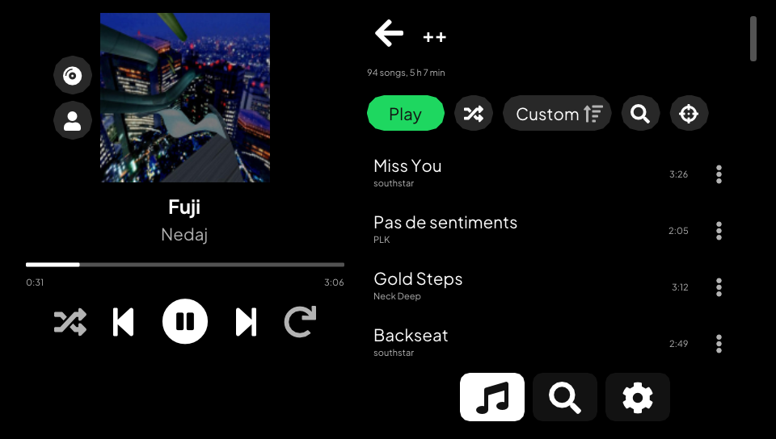
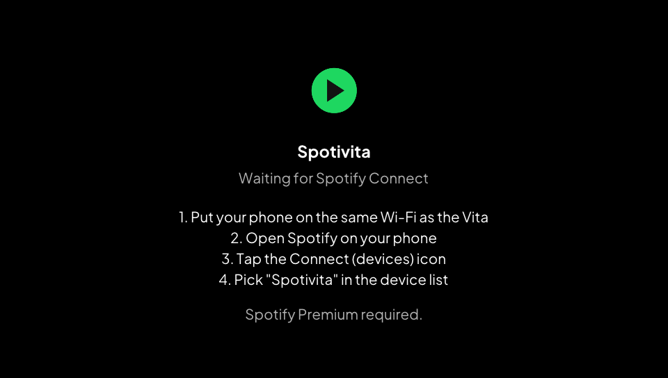

[](https://github.com/klNuno/spotivita/actions/workflows/ci.yml)

# Spotivita

A Spotify player for the PS Vita. Open your playlists, search for tracks and
play them on the console, or pick the Vita as a speaker from the Spotify app on
your phone.



Spotify Premium is required. Spotivita started as a fork of
[cspot_vita](https://github.com/michal4132/cspot_vita) and still streams
through [cspot](https://github.com/feelfreelinux/cspot). Most of the rest is
new: the interface, the library, search, local playback control and the
network layer.

## Features

- Your library as Spotify shows it: Liked Songs first, then your playlists
  and folders, in your order. It shows at once from a cache and refreshes in
  the background at each launch.
- Big playlists load whole. A 3800-song playlist shows every title in about
  3 seconds, then opens at once from a cache. Each one shows its song count
  and total length.
- Sort a playlist by title, artist, album, date added or duration, in either
  direction. Each playlist remembers its sort. A filter narrows it to the
  songs whose title, artist or album match.
- Shuffle play, a fast-scroll thumb that shows the letter, date or position
  under your finger, a button that scrolls to the song playing, and a right
  stick that speeds up the longer you hold it.
- A sleep timer: 15 minutes, 30 minutes, 1 hour or the end of the song.
- Search for songs, artists, albums and playlists. The results page shows a
  bit of each, with the top artist first when it matches; a chip opens one
  kind with every result, a page at a time.
- Artist pages: popular songs, albums, singles, compilations, "Appears on",
  playlists and similar artists, each with a "See all" page. Play the artist
  or shuffle it.
- Albums and public playlists open like your own playlists, with their cover,
  sort and filter. Nothing is added to your account: browsing is read-only.
- Every song row has a menu (the dots, or triangle on the row) to go to its
  album or one of its artists. On the player, tap the cover or the title for
  the album, the artist line for the artist, or use the two buttons by the
  cover with the gamepad.
- Play, pause, next, previous, seek on the progress bar, shuffle, repeat and
  volume, all handled on the Vita. Pause cuts the sound at once. Previous
  restarts the track after its first 3 seconds, like Spotify.
- Audio quality in Settings: Low (96 kb/s), Normal (160 kb/s) or Very high
  (320 kb/s, the default).
- Greek and Cyrillic titles. Emoji and CJK characters are left out, the fonts
  on the Vita do not have them.
- A black background, which turns the pixels off on the OLED model.
- Spotify Connect: the Vita shows up in the device list of the Spotify app, so
  your phone can drive it too.
- One device plays at a time, like Spotify. Start a song on your phone and the
  Vita pauses; start one on the Vita and the phone pauses.
- While another device plays, the Vita shows its song and drives it: play,
  pause, next, previous, seek and volume. "Play here" moves the playback to the
  Vita, at the same spot.
- Background playback: press the PS button and the music keeps going, screen
  off included. The interface stops drawing while it is in the background.
- No `libshacccg.suprx` needed. It draws with vita2d and precompiled shaders.

## Status

Everything above runs in the Vita3K emulator, which has no sound, so playback
there is checked by watching the position move. The vita2d build plays,
searches and runs in the background on a real PS Vita. A dropped connection
to Spotify used to leave the player silent and deaf to pause; the stream now
asks for the lost audio again after the reconnect. That fix has not been
through a real disconnect yet. The handover between the Vita and another
device has only run against a simulated phone so far. Artist pages, albums,
public playlists and the song menu have only run in Vita3K. If something breaks
on your Vita, please open an issue.

## Install

1. Get `spotivita.vpk`. Each CI run on `master` attaches it as the
   `spotivita-vpk` artifact (Actions tab, GitHub login needed). A release will
   follow the first hardware test.
2. Install it with VitaShell. Its TITLEID is `SPOTIVITA`, so it sits next to an
   existing CSpot install instead of replacing it.
3. Open Spotivita. It waits for Spotify Connect.

   

4. On your phone, on the same Wi-Fi, open Spotify, tap the devices icon and
   pick Spotivita. The Vita keeps that login, so later launches connect on
   their own.

Spotify turned off username and password logins in 2024. The Vita cannot log
in by itself anymore, so your phone hands it a login over the local network
(Zeroconf).

## How it talks to Spotify

- cspot keeps the session with Spotify's access point, streams and decodes the
  audio (Ogg Vorbis), and answers Spotify Connect.
- Playlists and track names come from spclient, search from the same GraphQL
  endpoint the web player uses.
- The public Web API answers 429 to every request from this client, so nothing
  depends on it. When you play a track, the Vita builds the queue itself and
  hands it to cspot.
- Search and artist pages use query hashes from the web player. When Spotify
  rotates them, those pages show "Spotify changed its API" until the app is
  updated.
- Albums, and the album and artists of a song, come from spclient's
  extended metadata.

## Building

You need [vitasdk](https://vitasdk.org) with the `vita2d`, `imgui-vita2d`,
`curl` and `openssl` packages, plus `protoc` and Python's `protobuf` and
`setuptools` on the host for nanopb.

```shell
git clone --recursive https://github.com/klNuno/spotivita.git
cd spotivita
cmake -B build && cmake --build build
```

The VPK lands in `build/spotivita.vpk`. `.github/workflows/ci.yml` builds it in
the `vitasdk/vitasdk` Docker image. That image installs OpenSSL 1.1.1 while its
libcurl expects 1.0.2, so the workflow swaps the package back first.

## Testing without the console in your hands

A devkit build adds a TCP server on port 2138. It returns the app state as
JSON and takes taps, swipes, buttons, screenshots, logs, file transfers and
eboot hot swaps. It can read and write files on the console, so release builds
leave it out.

```shell
cmake -B build/dev -DSPOTIVITA_DEVKIT=ON && cmake --build build/dev
python tools/vitactl.py find                 # finds the Vita on your /24
VITA_HOST=<vita-ip> python tools/vitactl.py deploy build/dev/eboot.bin
VITA_HOST=<vita-ip> python tools/vitactl.py "state; tap 660 492; shot s.png"
```

- `tools/vitasetup.py` prepares a console once. Open VitaShell, press SELECT
  to start its FTP server, run the script, then reboot. It installs
  [vitacompanion](https://github.com/devnoname120/vitacompanion), which serves
  FTP, takes launch, quit and reboot commands, and keeps the Vita awake. It also
  copies the dev build over the installed app, or leaves the VPK in
  `ux0:data/spotivita/` for VitaShell when the app is not installed yet. After
  that, `vitactl deploy` works even when the app has crashed.
- `tools/vita3k` runs the same build in Vita3K on a hidden Windows desktop,
  with no window on your screen. `tools/vita3k/login.py` logs the emulator in
  without a phone. Details are in [tools/vita3k/README.md](tools/vita3k/README.md).

## Credits

- [michal4132](https://github.com/michal4132) for cspot_vita, the base of this
  project.
- [feelfreelinux](https://github.com/feelfreelinux) and contributors for cspot
  and bell.
- The vitasdk, vita2d, Dear ImGui and vitacompanion projects.
- [Plus Jakarta Sans](https://github.com/tokotype/PlusJakartaSans) (OFL) and
  [Roboto](https://github.com/googlefonts/roboto) (Apache License 2.0, see
  `common_data/Roboto-LICENSE.txt`).

## Disclaimer

Using this code to connect to Spotify's API may be prohibited by their terms of
service. Use at your own risk. The developers are not responsible for any
negative consequences, including account closure.
